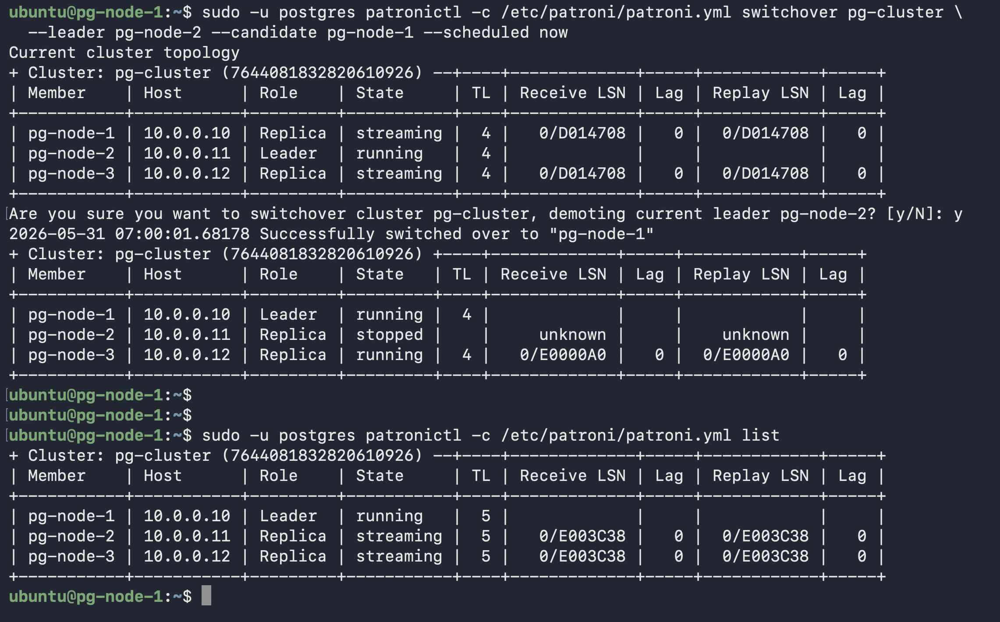
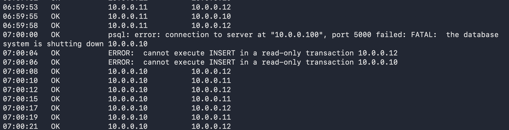

# Scenario 1 — Planned Switchover

**Use case:** Maintenance on the current primary. Move the primary role to another node with minimal downtime, keeping Patroni in full control.

**Downtime:** ~1-2 seconds (write blip during promotion)

---

## What was done

```bash
sudo -u postgres patronictl -c /etc/patroni/patroni.yml switchover pg-cluster \
  --leader pg-node-2 --candidate pg-node-1 --scheduled now
```

## What happened internally

1. Patroni gracefully demoted the current primary — PostgreSQL put into read-only mode
2. Candidate replica promoted and acquired the etcd leader lock
3. Timeline incremented: TL=2 → TL=3
4. HAProxy detected new primary via `/primary` health check within ~9 seconds
5. VIP remained on pg-node-1 — Keepalived is independent of Patroni leadership

## Key insight

**VIP does NOT move during a planned switchover.** Keepalived tracks HAProxy health, not Patroni leadership. Since HAProxy was healthy on all nodes throughout, the VIP stayed put even though the primary changed.

---

## app-traffic.sh during switchover


*Write failures during promotion — HAProxy detecting new primary*


*Traffic restored with new primary IP*
