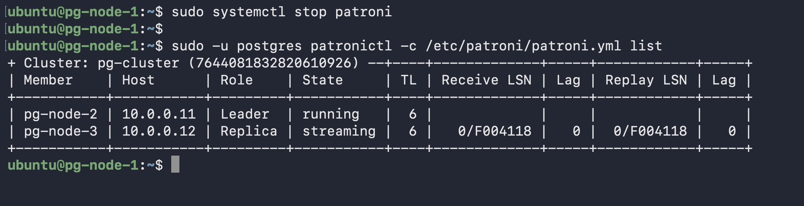
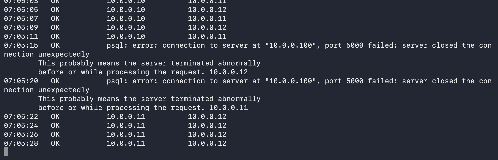

# Scenario 2 — Automatic Failover

**Use case:** Simulates an unexpected primary failure. Patroni detects the loss, waits for etcd TTL to expire, then holds an automatic election.

**Downtime:** ~25-30 seconds (TTL expiry + election + HAProxy detection)

---

## What was done

```bash
# On the primary node (pg-node-1):
sudo systemctl stop patroni
```

## What happened internally

1. Primary Patroni stopped → PostgreSQL on primary also stopped
2. Primary stopped renewing the etcd leader lock (`/service/pg-cluster/leader`)
3. After TTL expired (30s), etcd deleted the leader key
4. Surviving replicas raced to acquire the leader lock — first to write wins
5. Winner promoted itself, timeline incremented
6. Losing replica read the new leader from etcd and started replicating from it

## Why a specific node won the election

Both replicas had zero replication lag when the primary stopped. Patroni has **no explicit node priority** — unlike Keepalived's weighted priorities. The first replica to write its name to the etcd lock key wins. This is determined purely by timing.

## Node rejoining after failover

Because the primary was stopped cleanly (graceful shutdown, 0 lag at time of stop), **pg_rewind was not needed**. The stopped node's WAL was a clean subset of the new primary's WAL — no divergence. It rejoined via normal streaming replication.

---

## Failover evidence


*`systemctl stop patroni` on primary + `patronictl list` showing new leader elected*


*app-traffic.sh showing extended WRITE-FAIL window during election, then OK with new primary IP*
