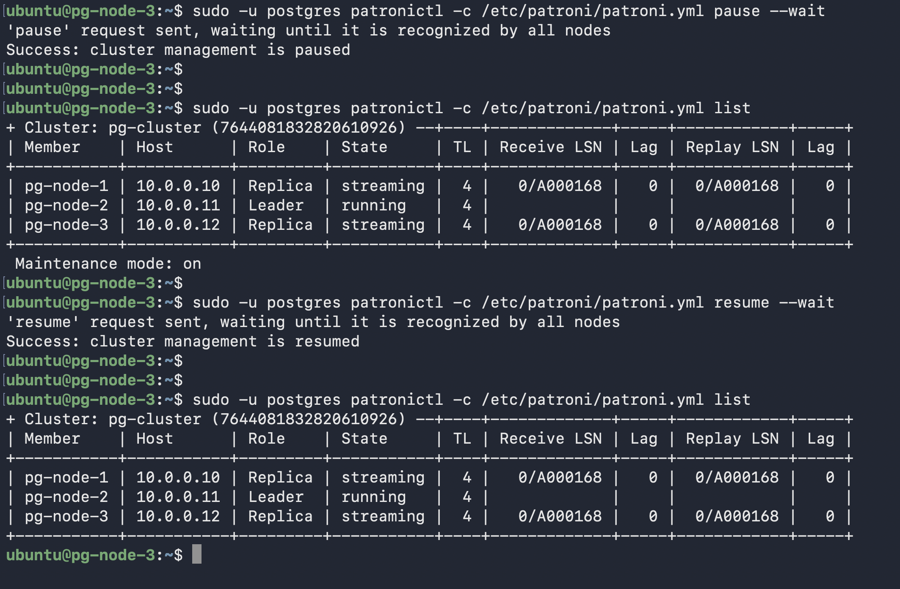

# Scenario 3 — Pause / Resume (Maintenance Window)

**Use case:** Before planned maintenance, freeze Patroni's HA automation so it doesn't react to intentional changes — e.g. restarting PostgreSQL for a config change without triggering auto-failover.

**Downtime:** None — PostgreSQL and replication continue normally throughout.

---

## What was done

```bash
# Pause all HA automation
sudo -u postgres patronictl -c /etc/patroni/patroni.yml pause --wait

# Verify
sudo -u postgres patronictl -c /etc/patroni/patroni.yml list
# Shows: Maintenance mode: on

# Resume after maintenance
sudo -u postgres patronictl -c /etc/patroni/patroni.yml resume --wait
```

## What happened internally

1. `pause` flag written to etcd by the node that ran the command
2. All 3 nodes read the flag within one loop_wait cycle (10 seconds)
3. Each node's HA loop continued running but took no automatic actions
4. PostgreSQL and replication continued normally — only decision-making was frozen
5. Every loop iteration logged: `PAUSE: no action. I am (pg-node-X)...`
6. `resume` removed the flag — all nodes returned to full HA mode within 10 seconds

## Critical warning

Pause does **NOT** protect you from failure — it prevents Patroni from **reacting** to failure. If the primary dies while paused:

- **Writes fail** — no primary to accept them, port 5000 has no healthy backend
- **Reads continue** — HAProxy still routes port 5001 to healthy replicas
- **No automatic failover** — Patroni will not elect a new primary until you run `resume`

To restore writes: either run `patronictl resume` (triggers automatic election) or manually promote a replica.

---

## Maintenance mode confirmed


*`patronictl list` showing `Maintenance mode: on` — HA automation frozen on all 3 nodes*
