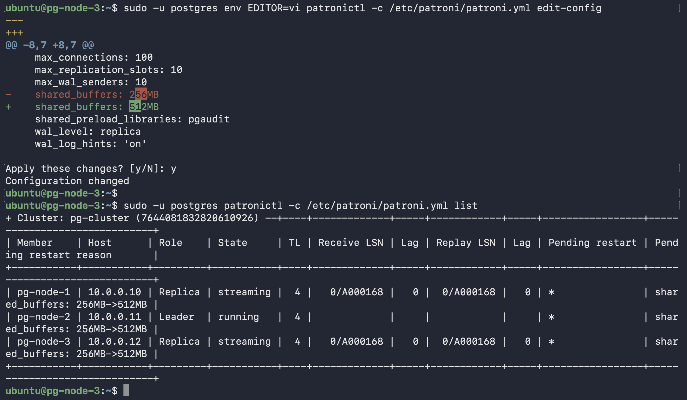
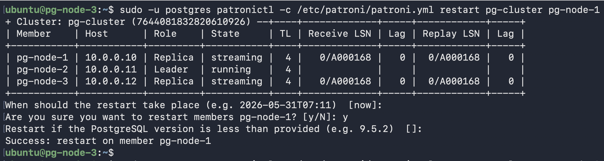

# Scenario 4 — Parameter Change (Reload vs Restart)

**Use case:** Tune PostgreSQL parameters across all 3 nodes using `patronictl edit-config` — writes to etcd, all nodes pick it up automatically. Never edit `postgresql.conf` or `patroni.yml` directly.

---

## How to determine reload vs restart

```sql
SELECT name, context FROM pg_settings WHERE name IN ('shared_buffers', 'work_mem');
-- context=postmaster → restart required
-- context=sighup    → reload only
```

---

## Part A — Reload only: `work_mem` (4MB → 16MB)

**Downtime:** None

```bash
# Edit cluster config in etcd
sudo -u postgres env EDITOR=vi patronictl -c /etc/patroni/patroni.yml edit-config
# Add: work_mem: 16MB

# Patroni automatically applies reload-only changes on its next loop iteration (within 10s)
# patronictl reload just forces it immediately — not required
sudo -u postgres patronictl -c /etc/patroni/patroni.yml reload pg-cluster

# Verify
sudo -u postgres patronictl -c /etc/patroni/patroni.yml query -r leader -c "SHOW work_mem;"
# Returns: 16MB
```

---

## Part B — Restart required: `shared_buffers` (128MB → 256MB)

**Downtime:** ~1-2s write blip when primary restarts

```bash
# Edit cluster config in etcd
sudo -u postgres env EDITOR=vi patronictl -c /etc/patroni/patroni.yml edit-config
# Add: shared_buffers: 256MB
```


*`patronictl list` showing `pending_restart * shared_buffers: 256MB→512MB` on all 3 nodes — Patroni tracks exactly what changed and why each node needs a restart*

```bash
# Check current leader first — do not assume which node is primary
sudo -u postgres patronictl -c /etc/patroni/patroni.yml list
# Restart replicas first (any node NOT showing Role=Leader) — zero app impact
sudo -u postgres patronictl -c /etc/patroni/patroni.yml restart pg-cluster pg-node-1
sudo -u postgres patronictl -c /etc/patroni/patroni.yml restart pg-cluster pg-node-3

# Restart primary last (the node showing Role=Leader) — brief ~1-2s write blip
sudo -u postgres patronictl -c /etc/patroni/patroni.yml restart pg-cluster pg-node-2
```


*`patronictl restart` — interactive prompts and success confirmation per node*

```bash
# Verify — pending_restart column gone
sudo -u postgres patronictl -c /etc/patroni/patroni.yml list
sudo -u postgres patronictl -c /etc/patroni/patroni.yml query -r leader -c "SHOW shared_buffers;"
# Returns: 256MB
```
