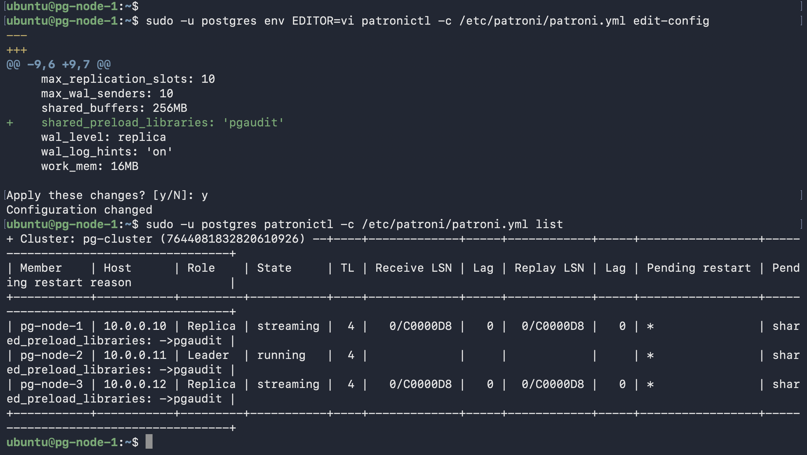
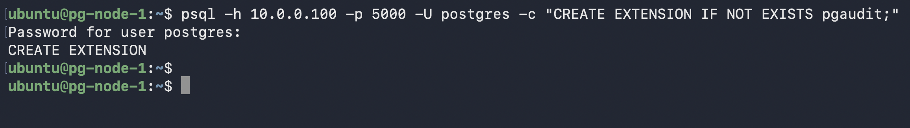
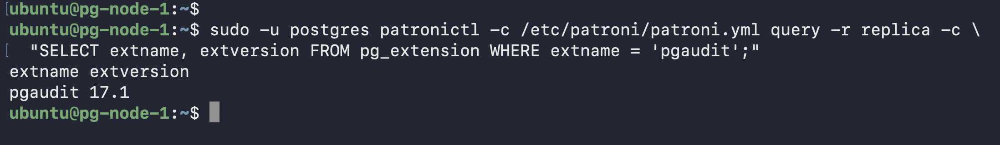

# Scenario 5 — Extension Installation

**Key rule:** OS package on all 3 nodes. `CREATE EXTENSION` on primary only — WAL replicates it to replicas automatically.

---

## Check before installing

```bash
# 1. Check database first
psql -h 10.0.0.100 -p 5000 -U postgres \
  -c "SELECT extname, extversion FROM pg_extension WHERE extname = 'pgaudit';"

# 2. Check OS package
dpkg -l | grep pgaudit
```

---

## Part A — Simple extension (no preload): `pg_repack`

**Downtime:** None

```bash
# Install on ALL 3 nodes
sudo apt install -y postgresql-17-repack

# Create on primary only
psql -h 10.0.0.100 -p 5000 -U postgres -c "CREATE EXTENSION IF NOT EXISTS pg_repack;"

# Verify on replica — WAL replicated DDL automatically
sudo -u postgres patronictl -c /etc/patroni/patroni.yml query -r replica \
  -c "SELECT extname, extversion FROM pg_extension WHERE extname = 'pg_repack';"
```

---

## Part B — Extension requiring preload: `pgaudit`

`pgaudit` hooks into PostgreSQL's executor to log SQL statements. It **must** be in `shared_preload_libraries` before `CREATE EXTENSION` — otherwise:
```
ERROR: pgaudit must be loaded via shared_preload_libraries
```

**Downtime:** ~1-2s write blip when primary restarts

```bash
# Install on ALL 3 nodes
sudo apt install -y postgresql-17-pgaudit

# Add to shared_preload_libraries via etcd
sudo -u postgres env EDITOR=vi patronictl -c /etc/patroni/patroni.yml edit-config
# Add: shared_preload_libraries: 'pgaudit'
```


*All 3 nodes show `pending_restart — shared_preload_libraries: ->pgaudit`*

```bash
# Restart replicas first, then primary
sudo -u postgres patronictl -c /etc/patroni/patroni.yml restart pg-cluster pg-node-1
sudo -u postgres patronictl -c /etc/patroni/patroni.yml restart pg-cluster pg-node-3
sudo -u postgres patronictl -c /etc/patroni/patroni.yml restart pg-cluster pg-node-2

# Create extension on primary only
psql -h 10.0.0.100 -p 5000 -U postgres -c "CREATE EXTENSION IF NOT EXISTS pgaudit;"
```


*`CREATE EXTENSION` on primary*

```bash
# Verify on replica
sudo -u postgres patronictl -c /etc/patroni/patroni.yml query -r replica \
  -c "SELECT extname, extversion FROM pg_extension WHERE extname = 'pgaudit';"
```


*pgaudit confirmed on replica — WAL replicated the DDL automatically*
