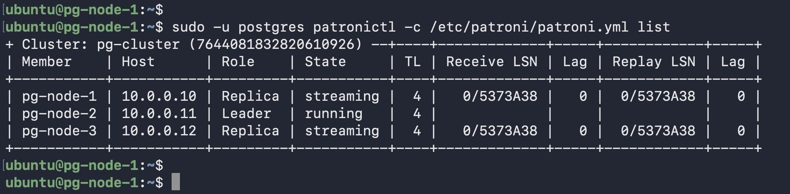
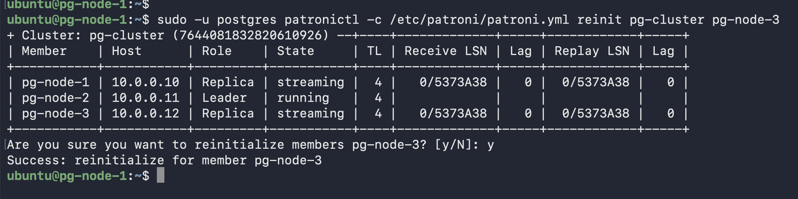
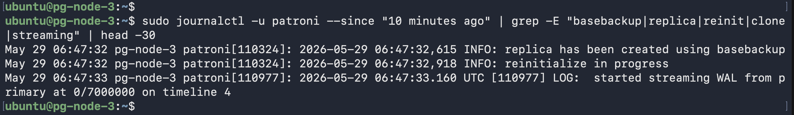
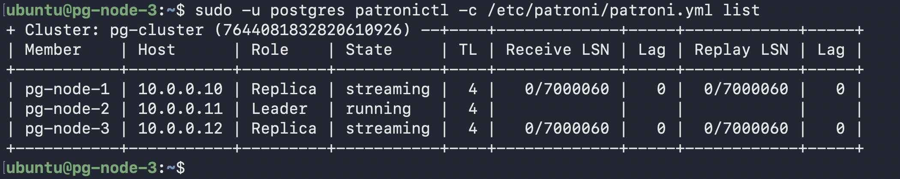

# Scenario 6 — Force Rebuild a Replica (patronictl reinit)

**Use case:** A replica's data directory is corrupt, too far behind to catch up via streaming, or pg_rewind failed. `reinit` wipes the data directory and rebuilds from scratch via `pg_basebackup` from the current primary.

**Downtime:** None — primary and other replica are unaffected.

---

## When to use reinit vs other methods

| Situation | Method |
|---|---|
| Clean shutdown, 0 lag at failover | Streaming replication (automatic) |
| Dirty crash, diverged WAL | pg_rewind (automatic via Patroni) |
| Corrupt data directory | `patronictl reinit` |
| Too far behind to stream | `patronictl reinit` |
| pg_rewind failed | `patronictl reinit` |

---

## What was done


*Cluster state before reinit — pg-node-3 healthy replica*

```bash
sudo -u postgres patronictl -c /etc/patroni/patroni.yml reinit pg-cluster pg-node-3
```


*`patronictl reinit` command and confirmation prompt*

## What Patroni did internally

1. Stopped PostgreSQL on pg-node-3
2. Wiped `/var/lib/postgresql/17/main` entirely
3. Ran `pg_basebackup` from the current primary
4. Restarted PostgreSQL on pg-node-3 in standby mode
5. Started streaming replication


*Patroni logs showing `pg_basebackup` completed and WAL streaming resumed*


*Cluster healthy — pg-node-3 back as streaming replica with 0 lag*
