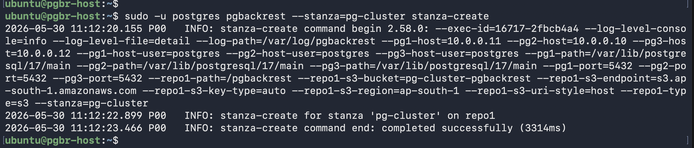
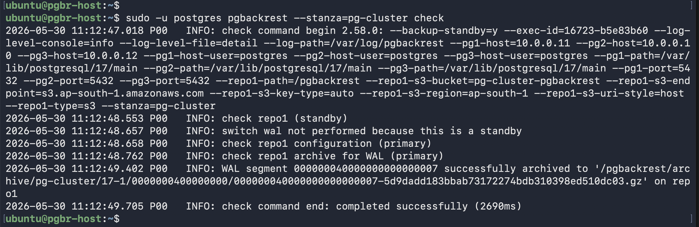
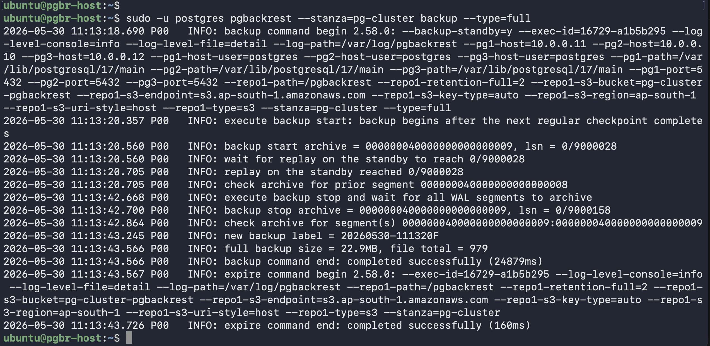
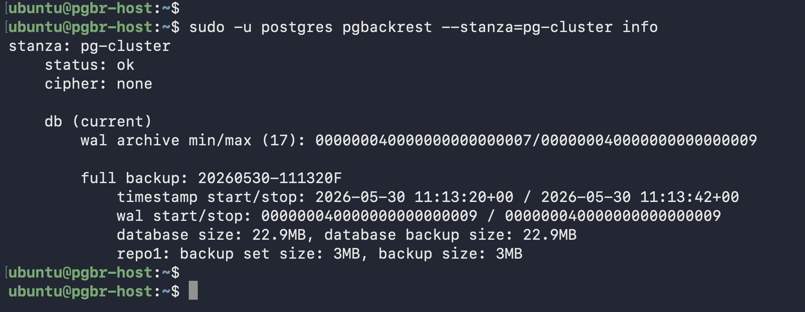
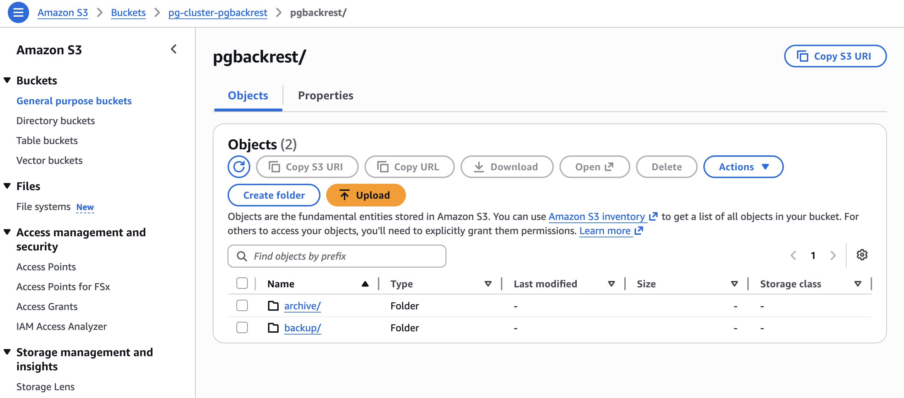

# Scenario 7 — pgBackRest Backup to S3

**Use case:** Enterprise-grade backup using pgBackRest with a dedicated repository host. Backups go to S3. The primary is never involved in backup file I/O — files are read from a standby.

---

## Architecture

```
pgbr-host (10.0.0.20)
    │  SSH — reads files from standby
    ├──────────────────► pg-node-1 (10.0.0.10)
    ├──────────────────► pg-node-2 (10.0.0.11)
    ├──────────────────► pg-node-3 (10.0.0.12)
    │  writes backup + WAL
    ▼
S3: pg-cluster-pgbackrest (ap-south-1)
```

**WAL archiving:** Only the current primary pushes WAL to S3 via `archive_command`. When a failover occurs, the new primary automatically takes over archiving — ensuring a continuous WAL chain with no gaps across leadership changes.  
**Backup:** pgbr-host SSHes into standby nodes, reads data files, writes compressed backup to S3.

---

## pgbr-host config (`/etc/pgbackrest/pgbackrest.conf`)

```ini
[global]
repo1-type=s3
repo1-s3-bucket=pg-cluster-pgbackrest
repo1-s3-region=ap-south-1
repo1-s3-endpoint=s3.ap-south-1.amazonaws.com
repo1-s3-uri-style=host
repo1-s3-key-type=auto
repo1-path=/pgbackrest
repo1-retention-full=2
backup-standby=y

[pg-cluster]
pg1-host=10.0.0.11
pg1-host-user=postgres
pg1-path=/var/lib/postgresql/17/main
pg1-port=5432
pg2-host=10.0.0.10
pg2-host-user=postgres
pg2-path=/var/lib/postgresql/17/main
pg2-port=5432
pg3-host=10.0.0.12
pg3-host-user=postgres
pg3-path=/var/lib/postgresql/17/main
pg3-port=5432
```

---

## Commands run (on pgbr-host)

**Create stanza:**
```bash
sudo -u postgres pgbackrest --stanza=pg-cluster stanza-create
```


*Stanza created — backup catalog initialised in S3*

**Verify archiving end to end:**
```bash
sudo -u postgres pgbackrest --stanza=pg-cluster check
```


*WAL segment successfully archived to S3 — full chain confirmed*

**Take full backup from standby:**
```bash
sudo -u postgres pgbackrest --stanza=pg-cluster backup --type=full
```


*`backup-standby=y` confirmed — primary only handled checkpoint, all 979 files read from standby. 22.9MB → 3MB after compression.*

**View backup catalog:**
```bash
sudo -u postgres pgbackrest --stanza=pg-cluster info
```


*Backup catalog showing label, WAL range, size, and compression ratio*

---

## S3 bucket contents


*`/pgbackrest/archive/` (WAL) and `/pgbackrest/backup/` (base backup) folders in S3*

---

## Key output explained

```
wait for replay on the standby to reach 0/9000028  ← backup-standby=y working
replay on the standby reached 0/9000028             ← standby in sync, file copy begins
full backup size = 22.9MB, file total = 979         ← files read from standby
new backup label = 20260530-111320F                 ← YYYYMMDD-HHMMSS + F=full
expire command end: completed successfully          ← retention enforced automatically
```
