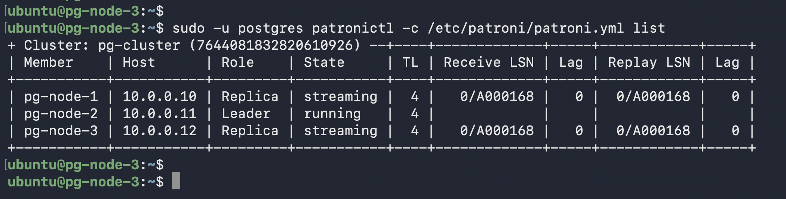
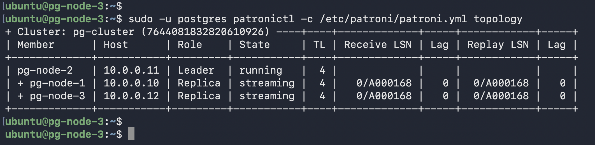
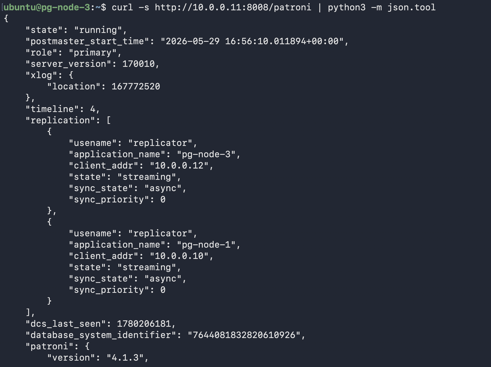
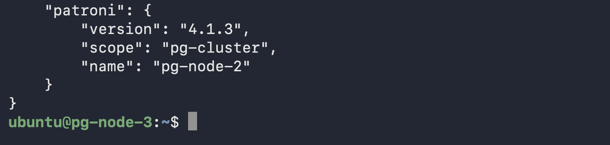
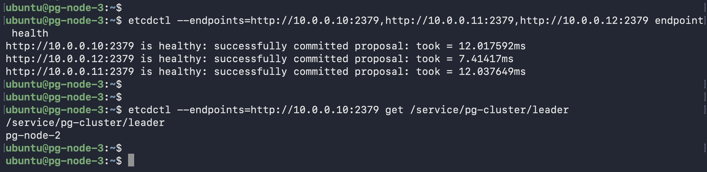
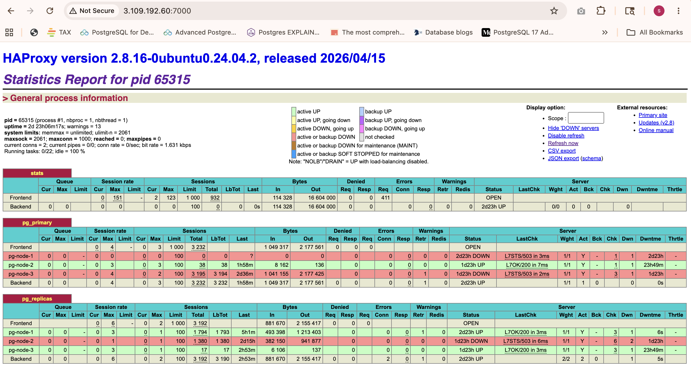
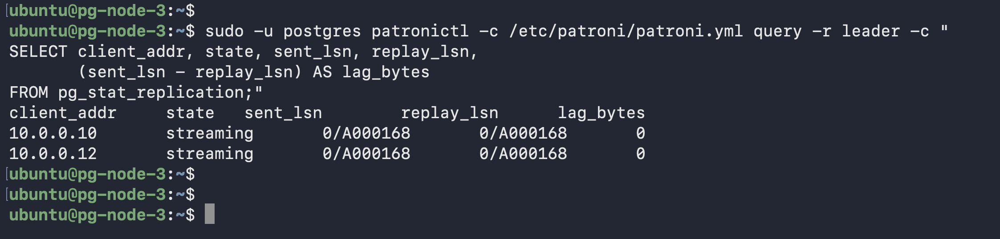
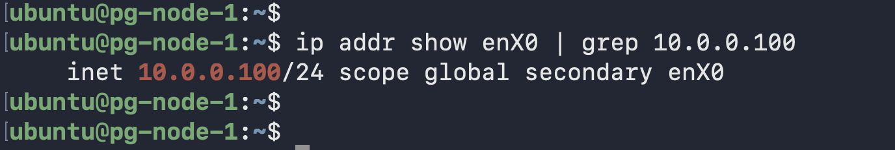

# Scenario 8 — Cluster Health Monitoring

**Use case:** Full observability check across all cluster layers — what a DBA runs at start of shift or during an incident.

> In production, these checks feed into Prometheus/Grafana via `postgres_exporter` and `patroni_exporter`, with AlertManager paging on lag thresholds, node failures, or etcd quorum loss.

---

## Layer 1 — Patroni

```bash
sudo -u postgres patronictl -c /etc/patroni/patroni.yml list
```


*All nodes — role, state, timeline, replication lag, pending_restart*

```bash
sudo -u postgres patronictl -c /etc/patroni/patroni.yml topology
```


*Replication tree showing primary → replica relationships*

---

## Layer 2 — Patroni REST API

```bash
curl -s http://10.0.0.11:8008/patroni | python3 -m json.tool
```




*Full JSON — role, state, timeline, replication lag, pending_restart, PostgreSQL version*

---

## Layer 3 — etcd

```bash
etcdctl --endpoints=http://10.0.0.10:2379,http://10.0.0.11:2379,http://10.0.0.12:2379 endpoint health
etcdctl --endpoints=http://10.0.0.10:2379 get /service/pg-cluster/leader
```


*All 3 etcd nodes healthy + current leader lock value*

---

## Layer 4 — HAProxy Stats

```bash
curl http://10.0.0.100:7000/
# Or open in browser: http://<elastic-ip>:7000/
```


*All backends green — primary on port 5000, replicas on port 5001*

---

## Layer 5 — Replication Lag

```bash
sudo -u postgres patronictl -c /etc/patroni/patroni.yml query -r leader -c "
SELECT client_addr, state, sent_lsn, replay_lsn,
       (sent_lsn - replay_lsn) AS lag_bytes
FROM pg_stat_replication;"
```


*Both replicas connected, 0 bytes lag*

---

## Layer 6 — VIP Location

```bash
ip addr show enX0 | grep 10.0.0.100
```


*VIP 10.0.0.100 confirmed on pg-node-1 (Keepalived MASTER)*
