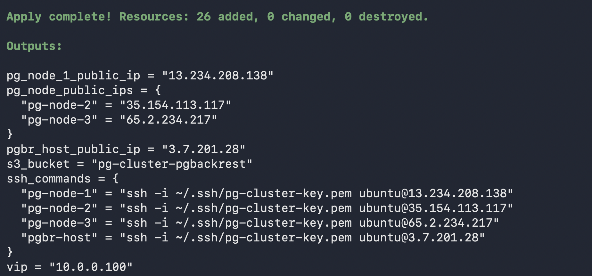
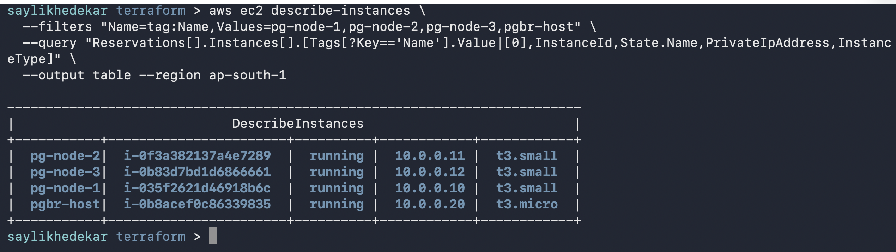
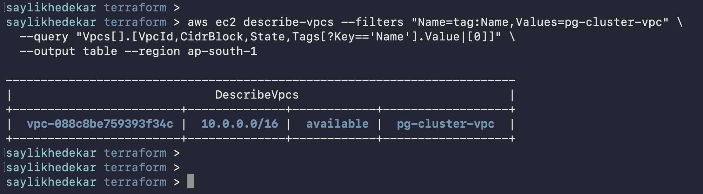
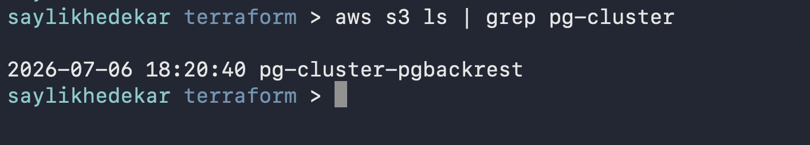
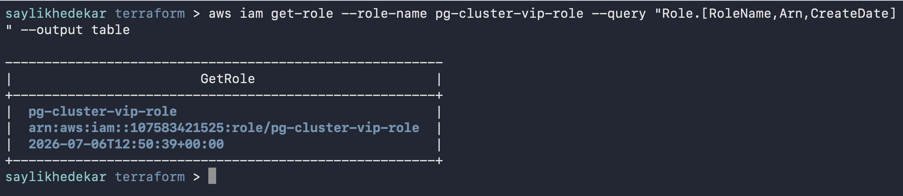

# Terraform — Patroni HA Cluster on AWS

Recreates the full AWS infrastructure for the 3-node Patroni HA cluster.

## What it creates

- VPC (`10.0.0.0/16`) + Subnet (`10.0.0.0/24`) + Internet Gateway + Route Table
- Security Group (`pg-cluster-sg`)
- 3 x EC2 t3.small — pg-node-1/2/3 (Ubuntu 24.04, 20GB gp3)
- 1 x EC2 t3.micro — pgbr-host (Ubuntu 24.04, 8GB gp3)
- 4 x Elastic IPs — one per instance
- Secondary private IP `10.0.0.100` on pg-node-1 ENI (VIP for Keepalived)
- IAM Role + instance profile (VIP management + S3 access)
- S3 bucket `pg-cluster-pgbackrest` (SSE-S3, no public access)
- VPC Gateway Endpoint for S3

## Prerequisites

- Terraform >= 1.9
- AWS CLI installed
- EC2 key pair already created in your target region
- IAM user with permissions from `terraform-deployer-policy.json`

## Usage

```bash
cd terraform/

# 1. Set required environment variables
export AWS_ACCESS_KEY_ID=<your-access-key>
export AWS_SECRET_ACCESS_KEY=<your-secret-key>
export AWS_DEFAULT_REGION=<your-region>        # e.g. ap-south-1
export TF_VAR_key_pair_name=<your-key-pair>    # existing EC2 key pair name

# 2. Initialise Terraform
terraform init

# 3. Preview what will be created
terraform plan

# 4. Apply
terraform apply
```

After apply, `terraform output` shows public IPs and SSH commands for all 4 nodes.

## Screenshots

**Terraform Output**


**EC2 Instances**


**VPC and Subnet**


**S3 Bucket**


**IAM Role**


## Variables

All variables have sensible defaults except `key_pair_name` (set via `TF_VAR_key_pair_name`).
Override any default in `terraform.tfvars` or via `TF_VAR_*` environment variables.

| Variable | Default | Description |
|---|---|---|
| `vpc_cidr` | `10.0.0.0/16` | VPC CIDR block |
| `subnet_cidr` | `10.0.0.0/24` | Subnet CIDR block |
| `s3_bucket_name` | `pg-cluster-pgbackrest` | S3 bucket for pgBackRest |
| `key_pair_path` | `~/.ssh/pg-cluster-key.pem` | Local path to .pem — used in ssh_commands output only |
| `key_pair_name` | — | Existing EC2 key pair name (required) |

## IAM Policy

`terraform-deployer-policy.json` contains the scoped IAM policy for the deployer user.
Create it in AWS IAM and attach it to your Terraform IAM user before running apply.

## After infrastructure is up

Follow `docs/setup-guide.md` to install and configure etcd, PostgreSQL 17, Patroni, HAProxy, Keepalived, and pgBackRest on the nodes.

## Destroy

```bash
terraform destroy
```
